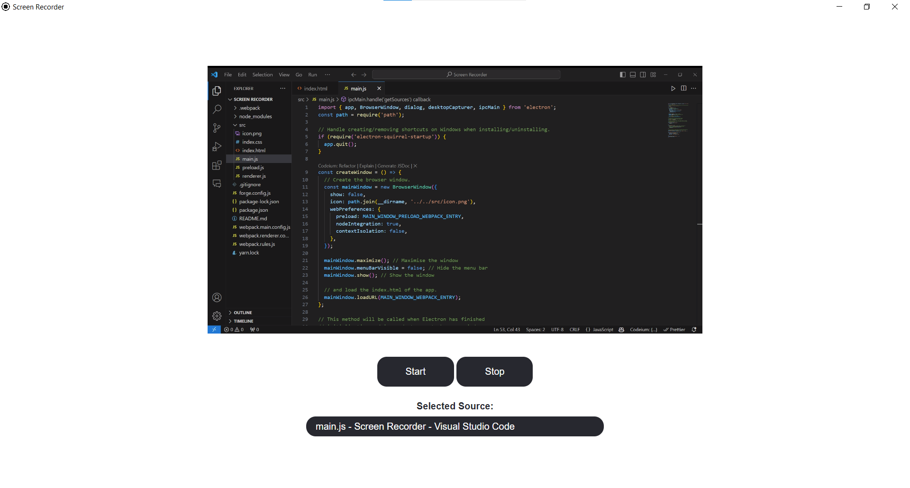

# Screen Recorder

## Overview

Screen Recorder is a lightweight desktop application built with Electron.js that allows users to capture video recordings of their screen. This application is designed for simplicity and efficiency, making it easy to start and stop recordings, select screen sources, and save videos to your local machine.

## App Demonstration



## Installation

### Prerequisites

- [Node.js](https://nodejs.org/) (v14 or higher)
- [Yarn](https://yarnpkg.com/) (optional, but recommended)

### Clone the Repository

```bash
git clone https://github.com/yourusername/screen-recorder.git
cd screen-recorder
```

### Install Dependencies

```
yarn install
# or
npm install
```

### Start the Application

```
yarn start
# or
npm start
```

### For building the application

```
yarn make
# or
npm run make
```

## Contributing

Contributions are welcome! Please fork the repository and submit a pull request with your changes. Ensure your code follows the project's coding standards and includes appropriate tests.

## License

This project is licensed under the MIT License. See the [LICENSE](LICENSE) file for details.